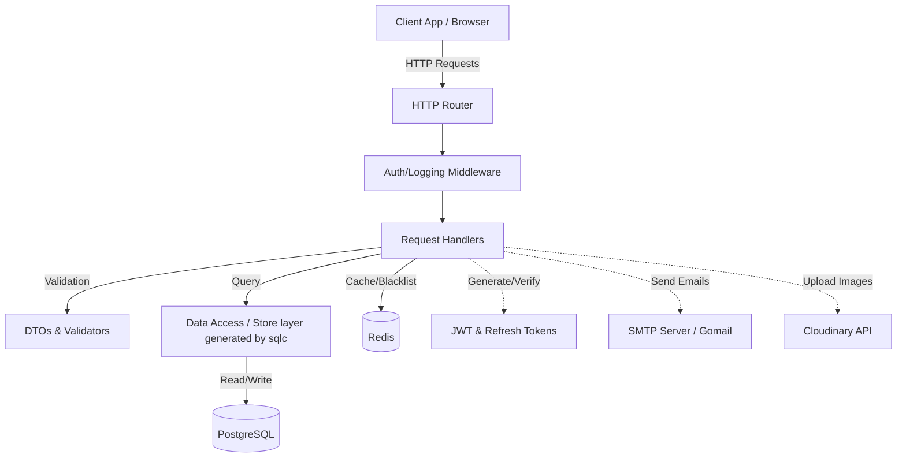
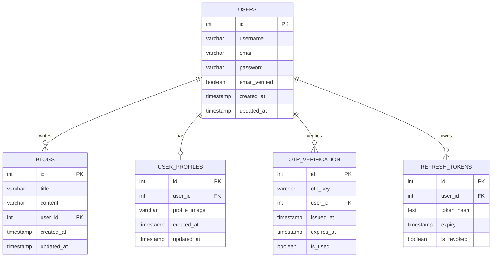
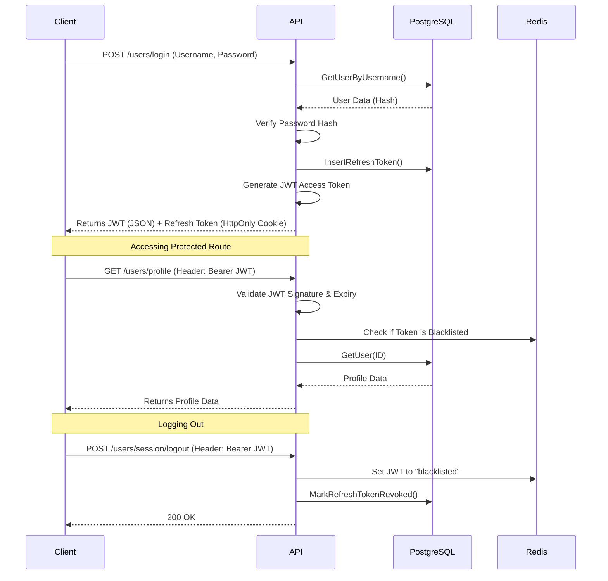

# Go REST API 🚀

A robust, production-ready RESTful API built with Go (Golang). It features a clean architecture, type-safe database interactions, JWT-based authentication with refresh tokens, email OTP verification, and image upload capabilities.

## 🌟 Features

*   **Authentication & Authorization:**
    *   Secure user registration and login.
    *   Stateless authentication using JWTs.
    *   Refresh token mechanism using HttpOnly cookies for enhanced security.
    *   Token blacklisting using Redis on logout.
*   **User Management:**
    *   Profile retrieval with Redis caching.
    *   Profile image upload to Cloudinary.
    *   Email verification via OTP (One Time Password) sent through SMTP.
*   **Database Interactions:**
    *   Type-safe SQL queries generated by `sqlc`.
    *   PostgreSQL as the primary source of truth.
    *   Database migrations handled by `dbmate`.
*   **Developer Experience & DevOps:**
    *   Fully containerized using **Docker** & `docker-compose`.
    *   Interactive API Documentation powered by **Swagger UI**.
    *   Live reloading inside containers via `air`.
    *   Modular and scalable directory structure.
    *   Standardized JSON responses and structured error handling.

## What this project demonstrates

- Secure authentication with refresh token rotation
- OTP-based email verification
- Redis caching and token blacklisting
- SQLC for type-safe queries
- Transaction handling and concurrency safety


## 🏗️ Architecture

The project follows a standard modular architecture, separating concerns into distinct layers:

### System Architecture Diagram



### Database Schema (ERD)



### Authentication Flow (Sequence Diagram)



### Directory Structure

- `cmd/`: Application entrypoints (if any, typically `main.go` at root).
- `internal/`: Private application and library code.
  - `dtos/`: Data Transfer Objects for request/response payloads.
  - `handlers/`: HTTP request handlers (Controllers).
  - `middleware/`: HTTP middlewares (e.g., Auth, Logging).
  - `migrations/`: `sqlc` schemas and generated queries.
  - `routes/`: Route definitions and multiplexer setup.
  - `store/`: Database access layer (generated by `sqlc`).
  - `utils/`: Utility functions (JWT, Password Hashing, OTP, etc.).
  - `validation/`: Request validation logic.
- `db/migrations/`: Database migration files for `dbmate`.
- `models/`: Domain models (shared data structures).

## 🚀 Getting Started

### Prerequisites

*   Go 1.22+
*   PostgreSQL
*   Redis
*   `dbmate` (for database migrations)
*   `air` (optional, for live reloading)

### Setup Instructions

1.  **Clone the repository:**
    ```bash
    git clone https://github.com/yourusername/go-resume-project1.git
    cd go-resume-project1
    ```

2.  **Environment Variables:**
    Copy the example environment file and fill in your details:
    ```bash
    cp .env.example .env
    ```

3.  **Run with Docker (Recommended):**
    The optimal way to start the ecosystem. This automatically spins up PostgreSQL, Redis, runs `dbmate` database migrations, and hosts the API with mapped live-reloading.
    ```bash
    docker compose up -d
    ```

    *Alternatively, to run natively on your machine without Docker:*
    ```bash
    make deps
    make migrate-up
    make run # Or start with `air`
    ```

## 📖 Interactive Swagger Documentation

This API features auto-generated interactive OpenAPI documentation using Swaggo.

Once your server is up and running, navigate directly to:
👉 **[http://localhost:8080/swagger/index.html](http://localhost:8080/swagger/index.html)**

Within the Swagger UI you can inspect request signatures, analyze expected response objects, and even test protected APIs locally by using the global **Authorize** button with your JWT token!

## 🧪 Testing with Postman

A comprehensive Postman collection (`GOLANG-PRODUCTION-GRADE-REST-API.postman_collection.json`) is included in the root of the repository to help you completely automate your local API testing.

### How to use it effectively:

1. **Import the Collection:** Open Postman, click on **Import**, and select the JSON file.
2. **Automatic Environment Variables:** The collection relies on embedded Postman Collection Variables. Ensure your collection variables look like this:
   - `baseUrl`: `http://localhost:8080`
   - `accessToken`: *(Leave blank)* 
   - `refreshToken`: *(Leave blank)*
3. **Automated Token Management (Magic Auth):** 
   - Simply execute the **Register** and then the **Login** request. 
   - Postman's built-in Test Scripts will automatically intercept the `access_token` and `refresh_token` from the login JSON response and seamlessly inject them into your collection variables!
   - All protected routes in the collection (like *Upload Profile Image*, *Get Profile*, *Verify OTP*, etc.) are pre-configured to inherit the authentication bearer token `{{accessToken}}`. Once you log in, everything else just works.
4. **Built-in Quality Assertions:** Every single route in this collection comes with pre-written Javascript Test Assertions. Just run the entire collection using Postman's "Collection Runner" to immediately verify:
   - HTTP Status Code correctness (200, 201).
   - Expected JSON schema structures.
   - Proper extraction of data and array lengths.
   - Latency rules (e.g., ensuring Server health-checks resolve in under 500ms).

## 📖 API Reference

### User Authentication

#### 1. Register User
- **Endpoint**: `POST /users/register`
- **Auth Required**: No
- **Request Body** (JSON):
  ```json
  {
    "username": "johndoe",
    "email": "johndoe@example.com",
    "password": "securepassword123"
  }
  ```
- **Response** (201 Created):
  ```json
  {
    "message": "User created successfully",
    "data": null
  }
  ```

#### 2. Login User
- **Endpoint**: `POST /users/login`
- **Auth Required**: No
- **Description**: Returns JWT in body and Refresh Token in `HttpOnly` cookie.
- **Request Body** (JSON):
  ```json
  {
    "username": "johndoe",
    "password": "securepassword123"
  }
  ```
- **Response** (200 OK):
  ```json
  {
    "message": "User logged in successfully",
    "data": {
      "token": "eyJhbGciOiJIUzI1NiIsInR..."
    }
  }
  ```

#### 3. Refresh Access Token
- **Endpoint**: `GET /users/refreshaccesstoken`
- **Auth Required**: No (Requires valid `refresh_token` cookie)
- **Response** (200 OK):
  ```json
  {
    "message": "Access token generated successfully",
    "data": {
      "token": "eyJhbGciOiJIUzI1NiIsInR..."
    }
  }
  ```

#### 4. Logout Session
- **Endpoint**: `POST /users/session/logout`
- **Auth Required**: Yes (Bearer Token)
- **Description**: Blacklists current JWT and revokes refresh token.
- **Response** (200 OK):
  ```json
  {
    "message": "User logged out successfully",
    "data": null
  }
  ```

### Email & OTP Verification

#### 5. Send Email OTP
- **Endpoint**: `POST /users/verifyemail`
- **Auth Required**: Yes (Bearer Token)
- **Description**: Generates an OTP and sends it to the registered email address.
- **Response** (200 OK):
  ```json
  {
    "message": "Email sent successfully",
    "data": null
  }
  ```

#### 6. Verify OTP
- **Endpoint**: `POST /users/verifyOtp`
- **Auth Required**: Yes (Bearer Token)
- **Request Body** (JSON):
  ```json
  {
    "otpkey": "123456"
  }
  ```
- **Response** (200 OK):
  ```json
  {
    "message": "Email verified successfully",
    "data": null
  }
  ```

### Profiles & Users

#### 7. Get Current User Profile
- **Endpoint**: `GET /users/profile`
- **Auth Required**: Yes (Bearer Token)
- **Response** (200 OK):
  ```json
  {
    "message": "User profile fetched successfully",
    "data": {
        "id": 1,
        "username": "johndoe",
        "email": "johndoe@example.com",
        "email_verified": true,
        "created_at": "2026-04-05T12:00:00Z"
    }
  }
  ```

#### 8. Upload Profile Image
- **Endpoint**: `POST /upload/`
- **Auth Required**: Yes (Bearer Token)
- **Content-Type**: `multipart/form-data`
- **Request Body**:
  * `profile_image`: [File Binary]
- **Response** (200 OK):
  ```json
  {
    "message": "Profile image uploaded successfully",
    "data": "https://res.cloudinary.com/..."
  }
  ```

#### 9. List All Users
- **Endpoint**: `GET /users/all?limit=10&offset=0`
- **Auth Required**: Yes (Bearer Token)
- **Response** (200 OK):
  ```json
  {
    "message": "Users listed successfully",
    "data": [
      {
        "id": 1,
        "username": "johndoe",
        "email": "johndoe@example.com",
        "email_verified": true
      }
    ]
  }
  ```

## 🛠️ Tech Stack

*   **Language:** Go (Golang)
*   **Database:** PostgreSQL
*   **Cache:** Redis
*   **ORM / Query Builder:** `sqlc` (Type-safe SQL)
*   **Migrations:** `dbmate`
*   **Authentication:** `golang-jwt/jwt`
*   **Documentation:** Swagger UI (`swaggo`)
*   **Containerization:** Docker & Docker Compose
*   **Storage:** Cloudinary (Profile Pictures)
*   **Email:** `gomail.v2`

## 💡 Potential Improvements

While this template is a great starting block, here are a few areas for potential, future enhancements:
1.  **Rate Limiting:** Implement a robust rate-limiting middleware (e.g., using Redis) for sensitive endpoints like login, registration, and OTP generation to prevent abuse.
2.  **OAuth2 Integration:** Add social login capabilities (Google, GitHub, etc.) alongside the existing email/password system.
3.  **Structured Logging:** Introduce a structured logging library like `zap` or `logrus` to replace standard output, improving log correlation and telemetry.
4.  **Extensive Testing:** Add a comprehensive suite of Unit and Integration tests, establishing mocks for external dependencies like Redis, PostgreSQL, and Cloudinary.
5.  **CI/CD Pipelines:** Implement GitHub Actions to run tests, security scanners, and eventually automate deployments.
