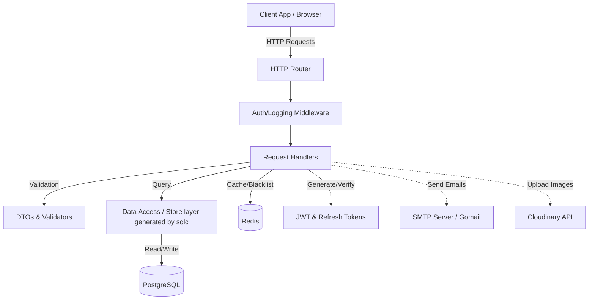
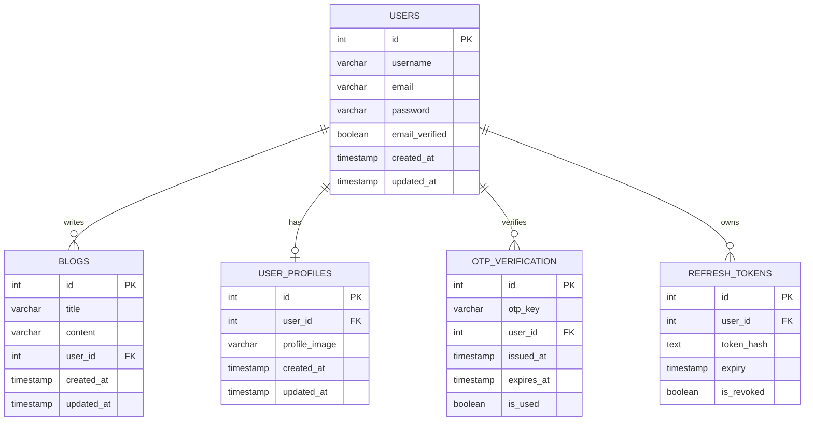
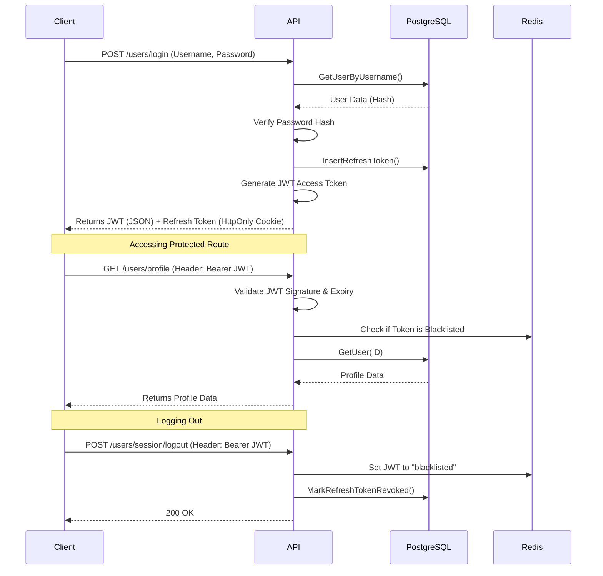

# Go REST API 🚀

A robust, production-ready RESTful API built with Go (Golang). It features a clean architecture, type-safe database interactions, JWT-based authentication with refresh tokens, email OTP verification, and image upload capabilities.

## 🌟 Features

*   **Authentication & Authorization:**
    *   Secure user registration and login.
    *   Stateless authentication using JWTs.
    *   Refresh token mechanism using HttpOnly cookies for enhanced security.
    *   Token blacklisting using Redis on logout.
*   **User Management:**
    *   Profile retrieval with Redis caching.
    *   Profile image upload to Cloudinary.
    *   Email verification via OTP (One Time Password) sent through SMTP.
*   **Database Interactions:**
    *   Type-safe SQL queries generated by `sqlc`.
    *   PostgreSQL as the primary source of truth.
    *   Database migrations handled by `dbmate`.
*   **Developer Experience:**
    *   Live reloading via `air`.
    *   Modular and scalable directory structure.
    *   Standardized JSON responses and structured error handling.

## 🏗️ Architecture

The project follows a standard modular architecture, separating concerns into distinct layers:

### System Architecture Diagram



### Database Schema (ERD)



### Authentication Flow (Sequence Diagram)



### Directory Structure

- `cmd/`: Application entrypoints (if any, typically `main.go` at root).
- `internal/`: Private application and library code.
  - `dtos/`: Data Transfer Objects for request/response payloads.
  - `handlers/`: HTTP request handlers (Controllers).
  - `middleware/`: HTTP middlewares (e.g., Auth, Logging).
  - `migrations/`: `sqlc` schemas and generated queries.
  - `routes/`: Route definitions and multiplexer setup.
  - `store/`: Database access layer (generated by `sqlc`).
  - `utils/`: Utility functions (JWT, Password Hashing, OTP, etc.).
  - `validation/`: Request validation logic.
- `db/migrations/`: Database migration files for `dbmate`.
- `models/`: Domain models (shared data structures).

## 🚀 Getting Started

### Prerequisites

*   Go 1.22+
*   PostgreSQL
*   Redis
*   `dbmate` (for database migrations)
*   `air` (optional, for live reloading)

### Setup Instructions

1.  **Clone the repository:**
    ```bash
    git clone https://github.com/yourusername/go-resume-project1.git
    cd go-resume-project1
    ```

2.  **Environment Variables:**
    Copy the example environment file and fill in your details:
    ```bash
    cp .env.example .env
    ```

3.  **Install Dependencies:**
    ```bash
    make deps
    ```

4.  **Database Migration:**
    Ensure PostgreSQL is running and update the `DATABASE_URL` in `.env`.
    ```bash
    make migrate-up
    ```

5.  **Run the Server:**
    ```bash
    make run
    # Or start with live reloading using Air:
    air
    ```

## 🛠️ Tech Stack

*   **Language:** Go (Golang)
*   **Database:** PostgreSQL
*   **Cache:** Redis
*   **ORM / Query Builder:** `sqlc` (Type-safe SQL)
*   **Migrations:** `dbmate`
*   **Authentication:** `golang-jwt/jwt`
*   **Storage:** Cloudinary (Profile Pictures)
*   **Email:** `gomail.v2`

## 💡 Potential Improvements

While this template is a great starting block, here are a few areas for potential, future enhancements:
1.  **Rate Limiting:** Implement a robust rate-limiting middleware (e.g., using Redis) for sensitive endpoints like login, registration, and OTP generation to prevent abuse.
2.  **OAuth2 Integration:** Add social login capabilities (Google, GitHub, etc.) alongside the existing email/password system.
3.  **Structured Logging:** Introduce a structured logging library like `zap` or `logrus` to replace standard output, improving log correlation and telemetry.
4.  **Swagger / OpenAPI Documentation:** Auto-generate API documentation to make it easier for frontend developers or third parties to integrate.
5.  **Extensive Testing:** Add a comprehensive suite of Unit and Integration tests, establishing mocks for external dependencies like Redis, PostgreSQL, and Cloudinary.
6.  **CI/CD Pipelines:** Implement GitHub Actions to run tests, security scanners, and eventually automate deployments.
7.  **Containerization:** Fully containerize the app using Docker, and set up a `docker-compose.yml` to spin up PostgreSQL, Redis, and the backend service effortlessly.
